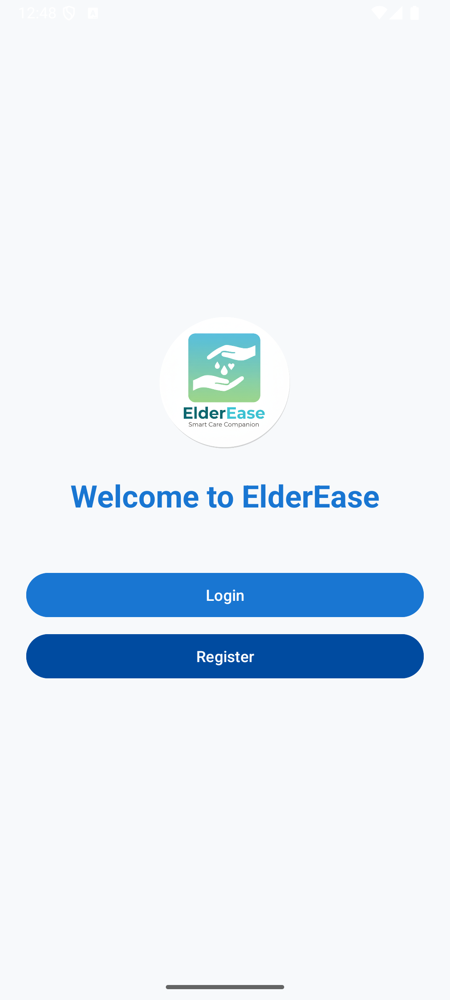
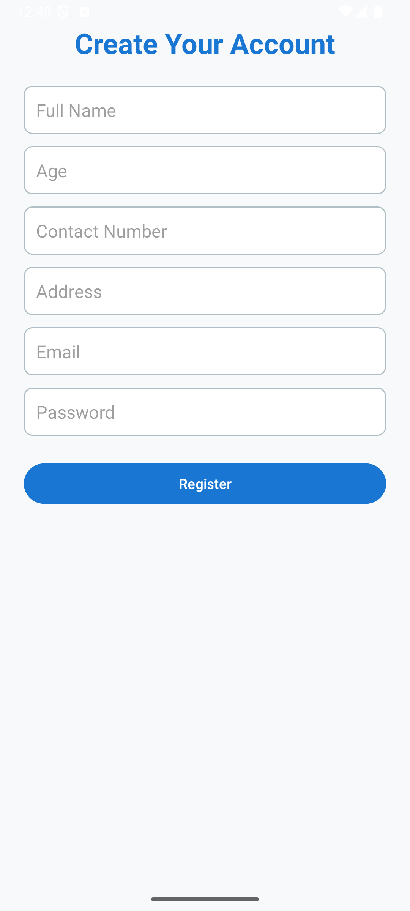
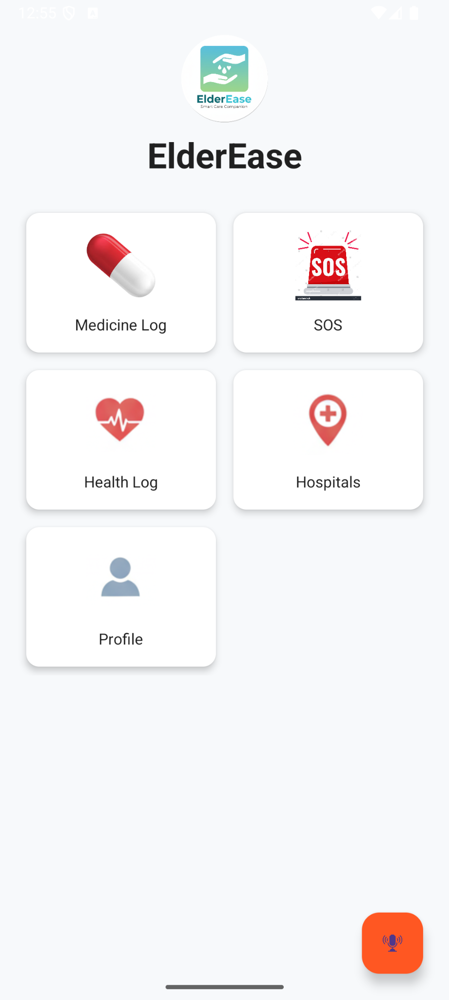
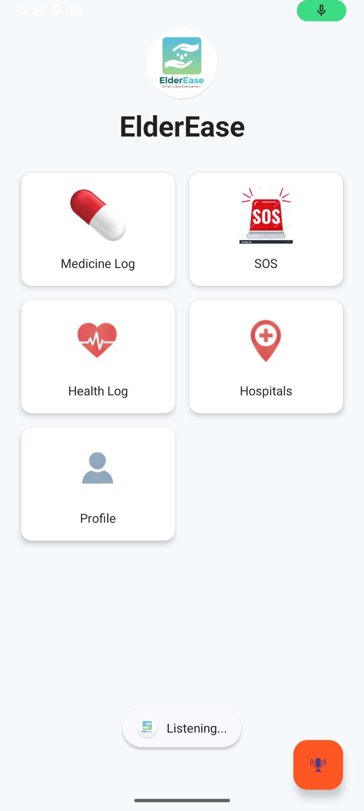

# 🩺 ElderEase

## Smart Healthcare & Safety Companion for Senior Citizens

ElderEase is an Android healthcare application designed to support senior citizens in managing their daily healthcare activities, emergency situations, and medical records. The application provides medicine reminders, health monitoring, emergency assistance, hospital location services, and profile management through an easy-to-use interface.

The goal of ElderEase is to improve the safety, independence, and overall well-being of elderly individuals by combining multiple healthcare services into a single mobile application.

---

## 📱 Features

### 💊 Medicine Reminder System

* Add medicine reminders.
* Select date and time.
* Set medicine frequency.
* Enable repeat reminders.
* Receive medicine notifications.

### 🚨 SOS Emergency Support

* Save emergency contact numbers.
* One-tap emergency calling.
* Emergency SMS support.
* Confirmation dialog before calling.

### ❤️ Health Log Management

* Record blood pressure.
* Record sugar levels.
* Record pulse rate.
* View previously saved health logs.

### 🗺️ Hospital Locator

* Google Maps integration.
* Display nearby hospitals.
* View hospital locations on the map.

### 👤 User Profile Management

* Create and edit profile.
* Store personal information.
* Upload profile picture.
* Persistent profile storage.

### 🔐 User Authentication

* User registration.
* User login.
* Firebase Authentication.

### 🔔 Notifications & Reminders

* AlarmManager integration.
* NotificationManager support.
* Medicine reminder alerts.

---

## Application Screenshots

### Splash Screen

### Welcome Screen

### Registration Screen

### Dashboard

### Medicine Reminder

### SOS Emergency

### Health Log

### Hospital Locator

### Profile Screen

### Voice Assistant

---

## 🛠 Technologies Used

* Java
* XML
* Android Studio
* Firebase Authentication
* SQLite Database
* Google Maps API
* SharedPreferences
* NotificationManager
* AlarmManager
* BroadcastReceiver

---

## 🗄 Database Technologies

* SQLite Database for medicine reminders.
* SharedPreferences for profile and SOS data.
* Firebase Authentication for user login and registration.

---

## 📂 Project Modules

1. Login & Registration Module
2. Medicine Reminder Module
3. Health Monitoring Module
4. SOS Emergency Module
5. User Profile Module
6. Hospital Locator Module

---

## 🎯 Problem Statement

Senior citizens often face challenges such as forgetting medicines, difficulty contacting family members during emergencies, maintaining health records, and locating nearby hospitals. ElderEase addresses these problems by providing an integrated healthcare and safety platform specifically designed for elderly users.

---

## 🚀 Future Enhancements

* Voice Assistant Integration
* Live Location Sharing
* Doctor Appointment Booking
* Firebase Cloud Database
* AI Health Recommendations
* Wearable Device Integration

---

## 👩‍💻 Developer

**Rateshwari Shakthivel**
B.Tech Artificial Intelligence & Data Science

---

## 📌 Developed Using

Android Studio • Java • XML • Firebase • SQLite • Google Maps API
